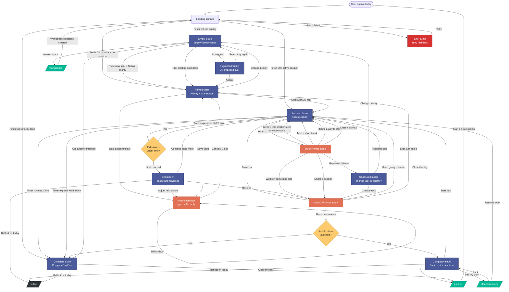

# Zentra `/today` User Flow

Navigation map of the Today screen. Corrected to remove dead ends, meaningless loops,
and invalid semantic transitions; all non-terminal states now have forward + recovery paths.

## Legend

- **Blue** — core view states of `/today`
- **Orange** — modals / inline prompts (all have a Cancel/Close back-edge)
- **Green** — external routes (user leaves `/today` but can return)
- **Yellow** — conditional branches
- **Dark** — terminal state (`/reflect` — end of day, no exits by design)
- **Red** — error state with retry + fallback

## Corrections applied

| # | Issue | Fix |
|---|---|---|
| 1 | `Workspaces` dead end | `Workspaces → Loading` after selection |
| 2 | `PlannerWorking` dead end | `PlannerWorking → NextUp` / `→ Focused` |
| 3 | `Planner` dead end | optional `Planner → Start` re-entry |
| 4 | `Reflect` | kept terminal (intentional) |
| 5 | `AfterMoveOn: No → Empty` wrong | now `→ Complete` |
| 6 | AI suggest soft loop | new `SuggestedPriority` state with Accept/Reject |
| 7 | NextActionInput validation | split `Save valid` vs `Still unclear` + Cancel |
| 8 | Modal cancels missing | Stuck/MoveOn/NextActionInput all have close edges |
| 9 | Timer extension infinite | `ExtendCheck` gate → `Checkpoint` after N |
| 10 | Stuck infinite loop | `StuckLimit` after N repetitions |
| 11 | MoveOn "Keep going" | treated as dismiss → `Focused` |
| 12 | Loading failure unhandled | new `Error` state with Retry / Close the day |

## Key endpoints

- `GET/POST /focus/sessions/active`
- `POST /focus/sessions/{id}/complete`
- `POST /focus/sessions/{id}/abandon`
- `POST /focus/sessions/{id}/extend`
- `POST /ai/clarify`, `POST /ai/decompose`, `POST /priority/suggest`
- `PATCH /tasks/{id}/next-action`
